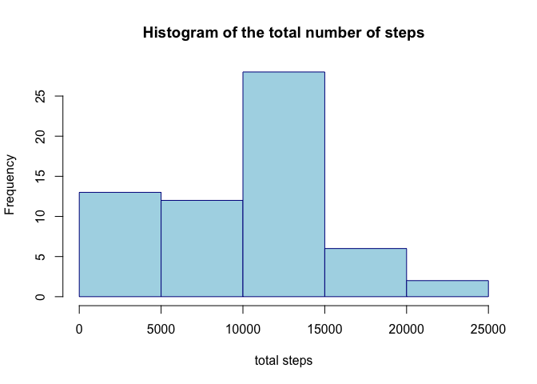
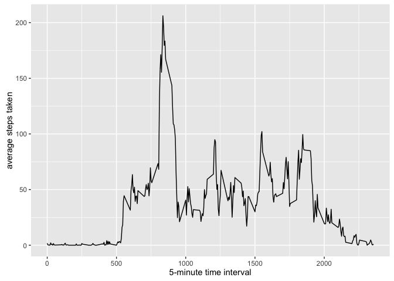
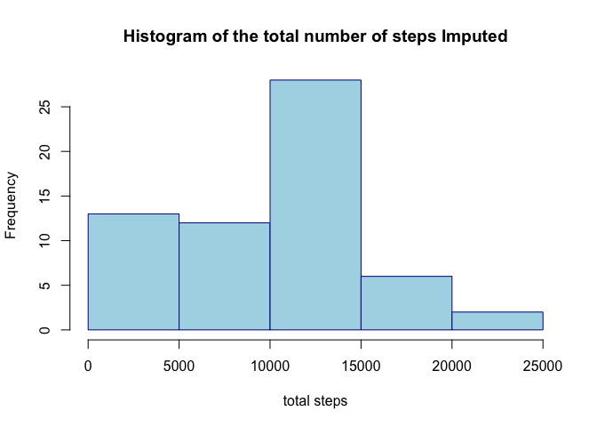
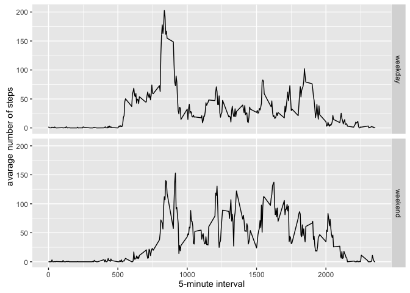

------------------------------------------------------------------------

##### - Load required libraries to proccess data and Graphs

      library(ggplot2)
      library(imputeMissings)

##### - Download and Load the project's data located at "<https://d396qusza40orc.cloudfront.net/repdata%2Fdata%2Factivity.zip>"

      if(!file.exists('activity.csv')){
          url <- "https://d396qusza40orc.cloudfront.net/repdata%2Fdata%2Factivity.zip"
          download.file(url=url, destfile='activity.zip', method='curl')
          unzip('activity.zip')
      }

##### 1.- Code for reading in the dataset and/or processing the data

      activityData <- read.csv('activity.csv')

##### - Process the raw data in order to create the tidy data

      totalSteps <- tapply(activityData$steps, activityData$date, sum, na.rm=TRUE)

##### 2.- Create a Histogram of the total number of steps taken each day

    hist(totalSteps
          ,border = "dark blue"
          ,col = "light blue"
          ,main = "Histogram of the total number of steps"
          ,xlab = "total steps") 

##### 3.- Mean and median number of steps taken each day

      mean(totalSteps, na.rm=TRUE)

    ## [1] 9354.23

      median(totalSteps, na.rm=TRUE)

    ## [1] 10395

##### 4.- Time series plot of the average number of steps taken

      averageStepsTime <- aggregate(x=list(meanSteps=activityData$steps), 
                          by=list(interval=activityData$interval), mean, na.rm=TRUE)
      ggplot(data=averageStepsTime, aes(x=interval, y=meanSteps)) +
                          geom_line() +
                          xlab("5-minute time interval") +
                          ylab("average steps taken") 

##### 5.- The 5-minute interval that, on average, contains the maximum number of steps

        stepsAmount <- which.max(averageStepsTime$meanSteps)
        timeSteps <-  gsub("([0-9]{1,2})([0-9]{2})", "\\1:\\2", averageStepsTime[stepsAmount,'interval'])

##### 6.- Code to describe and show a strategy for imputing missing data

Fill the missing values with the average value using the imputeMissings
package

      missing <- is.na(activityData$steps)
      summary(missing)

    ##    Mode   FALSE    TRUE    NA's 
    ## logical   15264    2304       0

##### 6.- Impute the missing values

      activityImputed <- activityData
      activityImputed <- impute(activityImputed, object = NULL, method = "median/mode", flag = FALSE)

##### 7.Histogram of the total number of steps taken each day after missing values are imputed

      stepsByDayImputed <- tapply(activityImputed$steps,  activityImputed$date, sum)
      
      hist(stepsByDayImputed
          ,border = "dark blue"
          , col = "light blue"
          ,main = "Histogram of the total number of steps Imputed"
          ,xlab = "total steps") 

##### 8.Calculate and report the mean and median total number of steps taken per day.

      imputedDailyStepsMean <- mean(stepsByDayImputed)
      imputedDailyStepsMedian <- median(stepsByDayImputed)
      
      imputedDailyStepsMean

    ## [1] 9354.23

      imputedDailyStepsMedian

    ## [1] 10395

##### 9. Panel plot comparing the average number of steps taken per 5-minute interval across weekdays and weekends

      activityImputed$dateType <-  ifelse(as.POSIXlt(activityImputed$date)$wday %in% c(0,6), 'weekend', 'weekday')
      
      averagedActivityImputed <- aggregate(steps ~ interval + dateType, data=activityImputed, mean)
      ggplot(averagedActivityImputed, aes(interval, steps)) + 
        geom_line() + 
        facet_grid(dateType ~ .) +
        xlab("5-minute interval") + 
        ylab("avarage number of steps")

